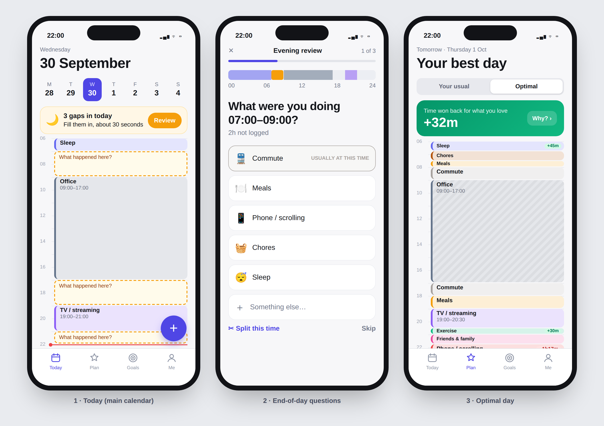
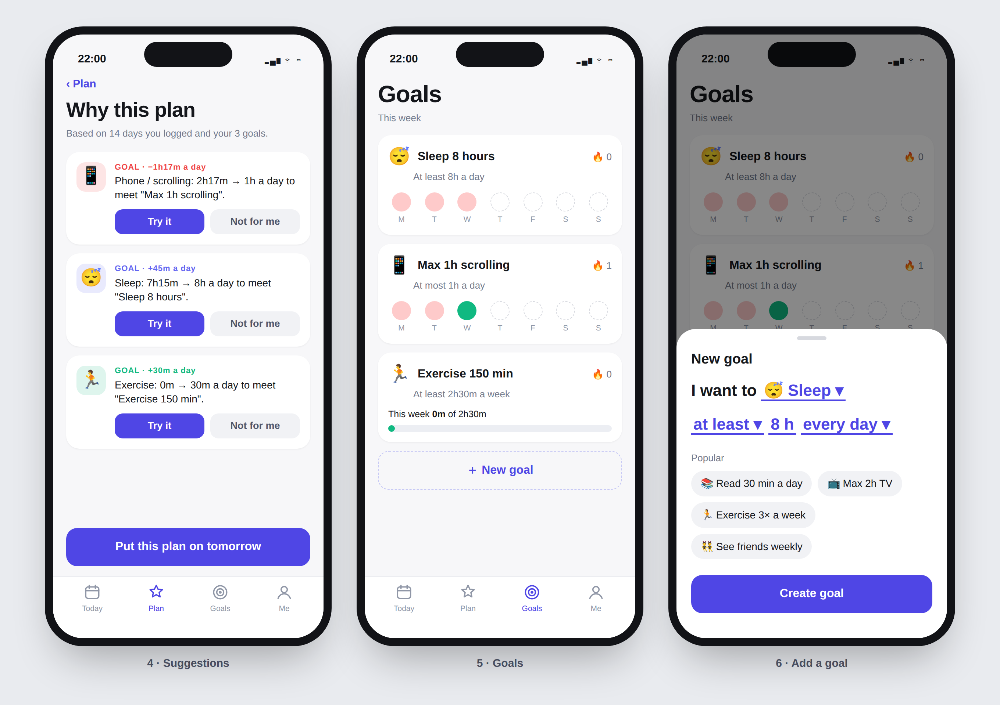

# Timeback

A calendar that learns how you actually spend your day and, once it has enough
data, proposes an **optimal day** that wins back time for the things you enjoy.

This folder is the application **spine**: the domain model, core logic, and
one service API. It is built to be a **phone app**, but has no UI yet; the
screens are designed (see below) and will call `TimebackApp`.

```
npm install        # dev tooling only (typescript); runtime has zero dependencies
npm run demo       # end-to-end walkthrough on 14 days of seeded data
npm test
npm run typecheck
```

Requires Node ≥ 22.18, which runs `.ts` files directly.

## The three features

| Feature | What the user does | Where it lives |
|---|---|---|
| **1. Main calendar** | Adds events like in any calendar. At the end of the day, answers a short form about the unlogged gaps ("What were you doing 17:00–19:00?"). Likely answers are ranked first, so most questions take one tap. | `calendar/`, `review/` |
| **2. Optimal-day calendar** | Views a second calendar showing what the day could look like, with the reasoning ("Scrolling: 2h12m → 1h to meet goal…"). It unlocks after 7 well-logged days. | `insights/`, `optimizer/` |
| **3. Goals** | Sets targets such as *sleep ≥ 8h/day*, *scrolling ≤ 1h/day*, *exercise ≥ 150 min/week*, and tracks progress and streaks. | `goals/` |

## Phone app design




Mockups are drawn from real engine output on the demo data. There are four
tabs:

| Tab | Screen | Engine call |
|---|---|---|
| **Today** | Day timeline. Unlogged gaps are dashed, and a banner links to the review. Use `+` to add an event. | `day`, `addBlock`, `startReview` |
| ↳ | **Evening review**: one question per screen, with big tap targets. The usual activity for that time is listed first. The user can split a gap or skip it. | `startReview`, `submitReview` |
| **Plan** | Tomorrow's optimal day, with a toggle to see your usual day. Changed activities get a +/− badge. The hero card shows time won back. | `optimalDay`, `compare` |
| ↳ | **Why this plan**: each suggestion with *Try it* / *Not for me*, plus "Put this plan on tomorrow". | `optimalDay().suggestions` |
| **Goals** | This week's hits and misses and streaks. New goals are written as a sentence: "I want to [Sleep] [at least] [8h] [every day]". | `goals`, `goalProgress`, `setGoal` |
| **Me** | Categories (enjoyment/flexibility), settings, data export. | `saveCategory`, settings |

### Platform plan

- **React Native + Expo.** The core is plain TypeScript with no Node-only
  imports, so it runs unchanged in the app. `JsonFileRepository` is a Node
  dev/demo adapter only and is not exported from `src/index.ts`.
- **Local-first storage.** Add a `SqliteRepository` (expo-sqlite)
  implementing `Repository`. All data stays on the phone, and sync is optional
  later.
- **Evening review notification.** Schedule a local notification (for example
  21:30, configurable) when `pendingReviews()` or today's gaps are non-empty.
- **Calendar import.** Read the device calendar (expo-calendar) into blocks
  with `source: 'import'`, so meetings don't have to be typed in twice.
- **Needed from the engine next:** accept/reject state for suggestions ("Try
  it" / "Not for me"), and "apply plan" to copy an optimal day into the
  calendar as planned blocks.

## Architecture

```
src/
  domain/      types.ts (the model), time.ts (wall-clock helpers), defaults.ts
  calendar/    dayView.ts         gaps, coverage, minutes per category (pure)
  review/      endOfDayReview.ts  gaps → questions → validated blocks (pure)
  goals/       goals.ts           per-period progress, streaks (pure)
  insights/    insights.ts        learns the typical day from history (pure)
  optimizer/   optimizer.ts       Optimizer interface + GreedyOptimizer (pure)
  storage/     repository.ts      persistence interface
               memoryRepository.ts, jsonFileRepository.ts
  app/         timebackApp.ts     facade: the only thing a UI calls
```

- **Pure core, one impure edge.** Everything except `storage/` and `app/` is
  a set of pure functions, so it is easy to test and could run on-device or
  on a server unchanged.
- **Storage behind an interface.** Swap the JSON file for SQLite or a backend
  API by implementing `Repository`.
- **Optimizer behind an interface.** `GreedyOptimizer` is a transparent
  heuristic. A constraint solver or an LLM planner can replace it without
  touching callers.

### Key modeling decisions

- **Categories carry two attributes.** Each has an *enjoyment* (`loves` /
  `neutral` / `dislikes`) and a *flexibility* (`fixed` / `essential` /
  `flexible`). These two attributes are all the optimizer uses to decide what
  to protect, trim, or grow.
- **Times are naive local strings** (`2026-09-30T23:00`). Blocks may cross
  midnight; day views clip them. Timezones belong at the device boundary.
- **Only well-logged days train the model** (≥ 80% of the day covered by
  default). Otherwise, missing data would look like "spent 0 minutes on it".
- **The baseline is per kind of day, not a flat average.** Fixed time comes
  from the calendar, or that weekday's history. Essentials use their daily
  average. Flexible time is the user's usual *share of free time*. Without
  this, a workday gets compared against weekend socializing and the plan
  overflows 24h. The demo exposed exactly this problem in an earlier version.

### How the optimal day is built

1. **Budget:** start from the baseline. Enforce goals, cut disliked flexible
   activities by up to `maxReductionShare`, and give the freed time to loved
   activities. If the plan is over-committed, shrink in this order: disliked,
   then neutral, then loved, then essential. Goal minimums are never cut.
2. **Place:** fill a 15-minute grid around fixed commitments. Each slot
   prefers the category the user historically does at that time, then
   extends existing chunks, then sits near the usual start time.
3. **Explain:** each change becomes a `Suggestion` (`meetGoal` / `reduce` /
   `reclaim`) with a human-readable message. `reclaimedMinutes` is the extra
   time given to loved activities.

## Known limitations / next steps

- **Phone UI.** Designed (see above), not built yet.
- **Fragmented placement.** Short activities can be split into 15-minute
  pieces (chores in the mockup). Placement should prefer one contiguous
  block per activity.
- **Recurring events and calendar import** (Google/ICS), via `source: 'import'`.
- **Multi-occurrence categories.** Meals are placed as a learned pattern but
  budgeted as one daily total, with no "3 meals" rule.
- **Closing the loop.** Let the user accept or reject a suggestion, then
  measure whether the next weeks moved toward the plan.
- **Timezones and DST** are not handled (see above).
